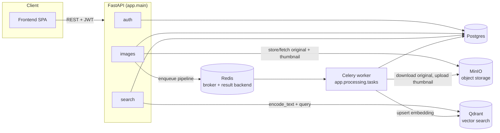
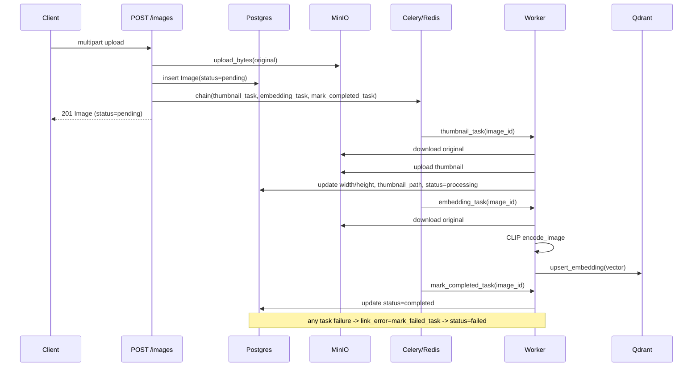
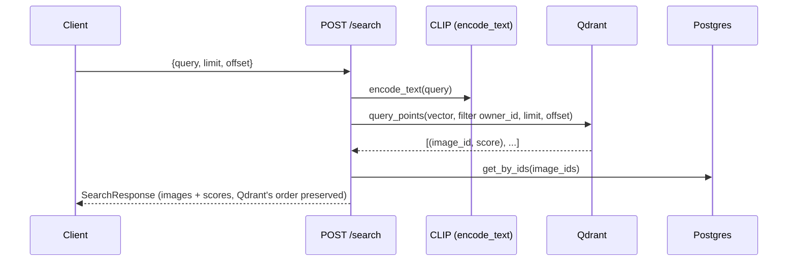

# VisionVault Backend

FastAPI backend for VisionVault: auth, image upload/storage, async thumbnail + CLIP embedding pipeline, and semantic search over Qdrant. See the repo-root [`README.md`](../README.md) for full-stack setup, and [`docs/PHASE_1_PLAN.md`](../docs/PHASE_1_PLAN.md) for the design decisions behind this structure.

## Structure

```
app/
├── main.py                FastAPI app, lifespan (bucket + Qdrant collection bootstrap), routers
├── auth/                   fastapi-users setup: User model, JWT backend, register/login/refresh routes
├── images/                 upload/list/get/delete/stats — api.py (routes) -> service.py (orchestration) -> repository.py (SQLAlchemy)
├── search/                 semantic search endpoint — api.py -> service.py -> Qdrant + ImageRepository
├── processing/tasks.py     Celery tasks: thumbnail -> embedding -> mark_completed (or mark_failed)
├── embeddings/              CLIP wrapper (clip.py) + Qdrant client (qdrant_client.py)
├── shared/storage.py        MinIO wrapper (upload/download/delete/presigned URL)
└── core/                    settings (config.py), SQLAlchemy engine/session (database.py), Celery app (celery_app.py)

alembic/                    DB migrations
tests/                      pytest suite (conftest.py spins up a real Postgres test DB per session)
```

Each feature module follows the same layering: `api.py` (thin FastAPI routes) → `service.py` (business logic, orchestration, validation) → `repository.py` (the only place touching SQLAlchemy). `api.py` never talks to the DB or MinIO directly except through `service`.

## Architecture



### Upload → processing pipeline

Uploading enqueues a Celery `chain`: each task loads the image row itself via `task_db_session()` (its own short-lived engine — see note below), so only the image ID is passed through the chain.



### Search



## Key implementation notes

- **Auth** (`app/auth/`): `fastapi-users` with a JWT bearer backend. `POST /auth/login` and `/auth/refresh` return an access + refresh token pair (access: `jwt_secret`/`jwt_lifetime_seconds`; refresh: separate `refresh_token_secret`/`refresh_token_lifetime_seconds`). Register/user-management routes come from `fastapi-users`' built-in routers.
- **Celery DB sessions** (`app/core/database.py::task_db_session`): each task calls `asyncio.run(...)` internally, giving it its own event loop. Reusing the app's module-level `engine`/`async_session_factory` (bound to a different loop) would hand out dead asyncpg connections, so tasks instead open a throwaway `NullPool` engine per call and dispose it when done.
- **Celery model registration** (`app/core/celery_app.py`): the worker process only imports `app.processing.tasks`, which never touches `app.auth.models`. Without an explicit import of `app.auth.models` there, SQLAlchemy never sees the `User` table defined in that process and `Image.owner_id`'s FK resolution fails — hence the explicit (unused) import with `noqa`.
- **Storage** (`app/shared/storage.py`): thin sync `Minio` client wrapped in `run_in_threadpool` for everything (upload/download/delete/presigned URL), since the official `minio` SDK is synchronous.
- **Embeddings** (`app/embeddings/clip.py`): CLIP model (`open-clip-torch`, default `ViT-B-32` / `laion2b_s34b_b79k`) is lazily loaded once per process into module-level globals — first call in the API process (search) or worker process (embedding) pays the load cost.
- **Bucket/collection bootstrap** (`app/main.py` lifespan): `ensure_bucket_exists()` and `ensure_collection_exists()` run on app startup. Tests bypass FastAPI's lifespan (`httpx.ASGITransport` doesn't trigger it), so the test suite assumes the bucket/collection already exist from a prior real run — see `tests/conftest.py`.

## Prerequisites

- [uv](https://docs.astral.sh/uv/), Python 3.12+
- Postgres, Redis, Qdrant, MinIO — via `docker compose -f ../docker/docker-compose.yml up -d`

## Setup

```
cp .env.example .env   # adjust if your infra ports/creds differ from the compose defaults
uv sync
uv run alembic upgrade head
```

## Running

```
# API
uv run uvicorn app.main:app --reload --host 0.0.0.0 --port 8000

# Celery worker (separate terminal)
uv run celery -A app.core.celery_app worker --loglevel=info --pool=solo
```

`--pool=solo` is used because the default workers don't play well with Windows; drop it for prefork on Linux/macOS if you want concurrency.

From the repo root, `scripts\dev.ps1` starts infra + API + worker + frontend together.

## Migrations (Alembic)

```
uv run alembic revision --autogenerate -m "describe the change"
uv run alembic upgrade head
uv run alembic downgrade -1
```

Autogenerate only sees models imported in `alembic/env.py` — when adding a new feature module's models, import them there too (see the existing `User`/`Image` imports and the `# noqa: F401` comments).

## Tests

```
uv run pytest
```

Needs a real Postgres reachable at `DATABASE_URL`'s host (the test session creates/drops a `visionvault_test` database there) and a real MinIO with the configured bucket already existing (presigned URL generation hits MinIO's `GetBucketLocation` for real). Qdrant, Celery, and CLIP calls are mocked at the service boundary — see `tests/test_images.py`/`tests/test_search.py` for which specific tests are the exception and hit MinIO for real.

## Lint / type-check

```
uv run ruff check .
uv run mypy app   # not currently enforced in CI — pre-existing errors not yet cleaned up
```
