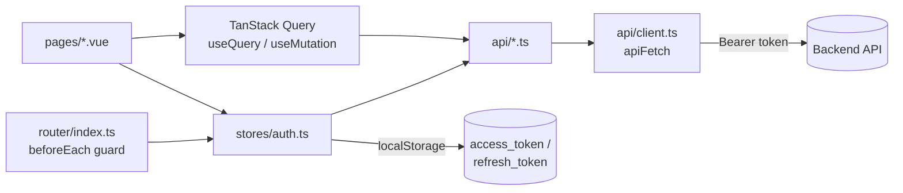
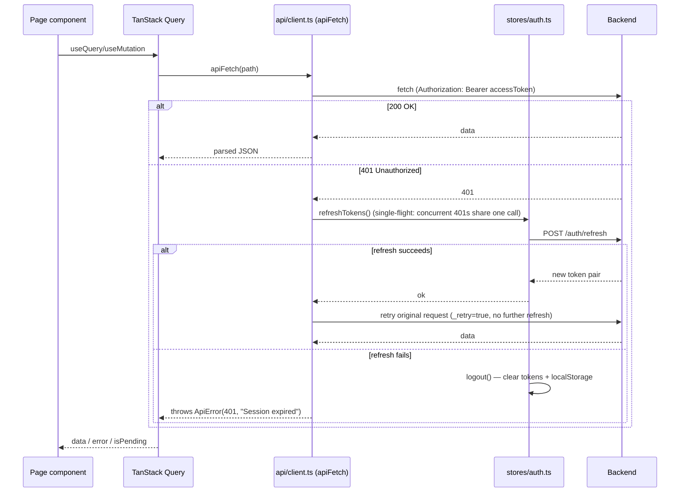

# VisionVault Frontend

Vue 3 SPA for VisionVault: login/register, upload, gallery, and semantic search against the [backend API](../backend/README.md). See the repo-root [`README.md`](../README.md) for full-stack setup, and [`docs/PHASE_1_PLAN.md`](../docs/PHASE_1_PLAN.md) for the design decisions behind this structure.

## Structure

```
src/
├── main.ts                 app bootstrap: Pinia, vue-router, TanStack Query
├── App.vue                  root component (just <RouterView/>)
├── router/index.ts          routes + auth guard (hydrate-once, redirect logic)
├── stores/auth.ts            Pinia auth store — tokens, current user, login/register/refresh/logout
├── api/                      fetch wrappers per resource
│   ├── client.ts             apiFetch: auth header, 401 refresh-and-retry (single-flight), error parsing
│   ├── auth.ts                login/register/refresh/me
│   ├── images.ts              list/upload/delete/stats
│   └── search.ts              semantic search
├── pages/                    one component per route (Login, Register, Dashboard, Upload, Gallery, Search)
├── layouts/AppLayout.vue     header/nav + logout, wraps the authenticated routes' <RouterView/>
├── components/ui/            shadcn-vue primitives (Button, Input, Label, Card, Badge) — thin wrappers, no app logic
├── types/                    shared request/response types (auth, image, search)
└── lib/utils.ts              cn() class-merge helper for shadcn-vue components

tests/                       vitest suite, mirrors src/ (api/, stores/, router/, pages/, layout/)
```

## Architecture



- **Data fetching**: pages call `api/*.ts` functions directly through TanStack Query (`useQuery`/`useMutation`), not through the Pinia store — the store only owns auth state (tokens + current user).
- **Auth state**: `stores/auth.ts` seeds `accessToken`/`refreshToken` from `localStorage` once, at store-creation time (not reactively re-read), and mirrors every token change back to `localStorage` via `setTokens`.
- **Routing guard**: `router/index.ts` calls `auth.hydrate()` exactly once (a module-level `hydrated` flag, not per-navigation) before the first navigation resolves, then redirects unauthenticated users off protected routes and authenticated users off `/login`/`/register`.

### Request flow, including the 401 refresh path



## Prerequisites

- Node 22+ and npm
- A running backend (see [`../backend/README.md`](../backend/README.md)) — or at least `VITE_API_BASE_URL` pointing at one

## Setup

```
cp .env.sample .env   # VITE_API_BASE_URL, defaults to http://127.0.0.1:8000
npm install
```

## Running

```
npm run dev
```

http://localhost:5173. From the repo root, `scripts\dev.ps1` starts infra + backend + worker + frontend together.

## Build

```
npm run build
```

Runs `vue-tsc -b` (type-check) then `vite build`.

## Tests

```
npm run test
```

`vitest` + `@vue/test-utils` + jsdom. Pages that use TanStack Query (`Dashboard`, `Upload`, `Gallery`, `Search`) mount with a fresh `QueryClient` (`retry: false`) via `VueQueryPlugin` per test. `@/stores/auth` and `@/api/*` are mocked with `vi.mock` rather than hit for real. UI primitives under `components/ui/` aren't covered — they're thin shadcn-vue wrappers with no app logic. Playwright/E2E is deferred per the phase plan until there's more UI flow to justify it.

## Lint / type-check

```
npx eslint .
npx vue-tsc -b --noEmit
```

`npm run lint` runs `eslint . --fix` (mutates files) — CI runs plain `eslint .` instead.
